# Artikelstamm (Zusatzmodul)
Das Modul Artikelstamm bietet die Möglichkeiten Daten zu verschiedenen Typen von Artikeln in der Anwendung zu verwalten. Dabei unterscheidet das System in die verschiedenen Artikeltypen:

- Material
- Dienstleistungen
- Kosten
- Werkzeug
- Setartikel

Die so gespeicherten Informationen bilden die Grundlage für weitere Prozesse wie z.B. Angebote, Aufträge oder After Sales Service orientierte Prozesse.

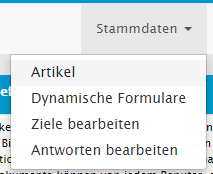

## Artikelliste im Backend
Die Artikelliste stellt alle vorhandenen Artikel dar. Dabei werden unterschiedliche Symbole für die Artikeltypen verwendet.

Symbol|Bedeutung
------:|:-----
 | Material
 | Dienstleistungen
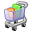 | Kosten
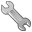 | Werkzeug
 | Setartikel

Über den Verweis in der Darstellung kann die Detailansicht der Artikel geöffnet werden. Artikel können mit Schlagwörtern oder dem neben der Liste befindlichen Filter durchsucht werden.

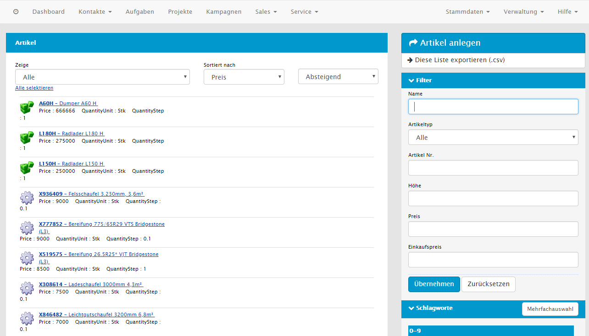

## Artikelliste im mobilen Client

Die Artikelliste im mobilen Client bietet zusätzlich zur Listendarstellung, welche ähnlich aufgebaut ist wie die Artikelliste im Backend, eine Darstellung als Vorschaubilder.

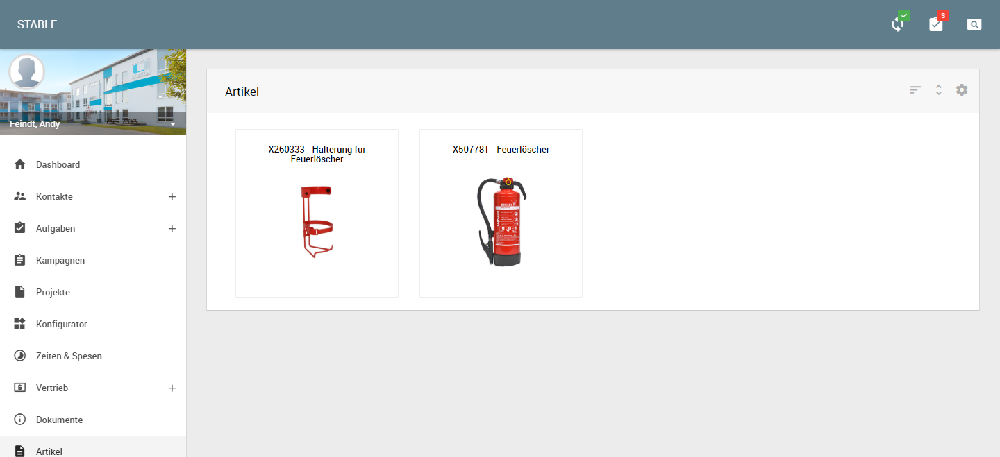

Die hier angezeigten Produktbilder können im Backend in den Seitenleisten der jeweiligen Detailseiten der Artikel gepflegt werden.

## Artikel anlegen
Neue Artikel können über die Kontextaktion __Artikel anlegen__ hinzugefügt werden. Dabei wird zunächst der Artikeltyp ausgewählt. Ausgehend vom gewählten Artikeltyp stehen unterschiedliche Eingabefelder im Formular zur Verfügung. 

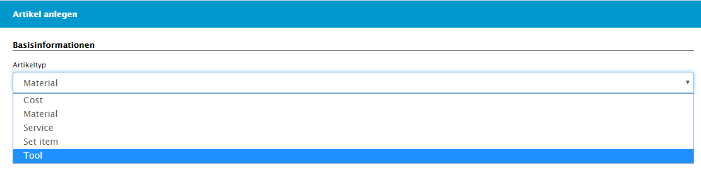

----
**Hinweis** Die Auswahl des Artikeltyp ist das erste was im Formular erfolgen muss, da ausgehend vom Typ unterschiedliche Felder angeboten werden. Eine nachträgliche Änderung kann ggf. zu einem Datenverlust führen.

----

Für alle Artikeltypen müssen jedoch mind. die folgenden Informationen erfasst werden:

- eindeutige Artikelnummer
- Artikelbeschreibung
- Mengeneinheit

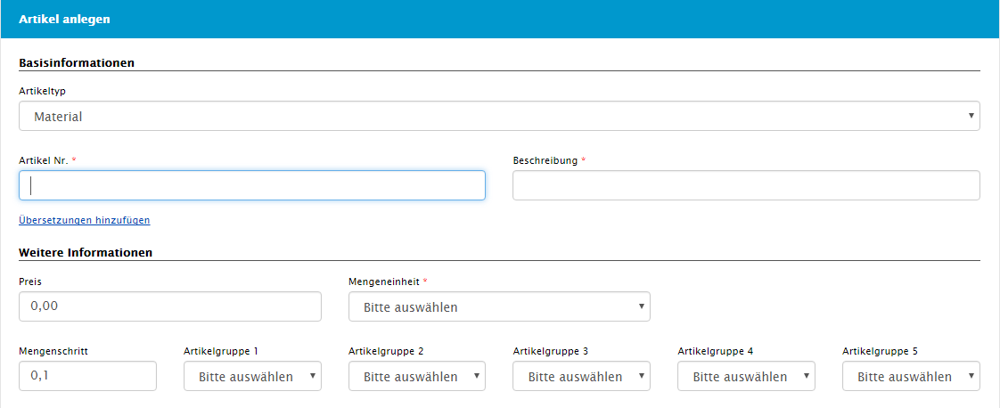

Unter „weitere Informationen“ werden der Preis sowie die Mengeneinheit _ME_ festgelegt. Als Option bieten sich hier drei Dropdownlisten für Artikelgruppen um diese zu gruppieren. Die Artikelgruppen können in der Verwaltung festgelegt werden und dienen dazu, mehrere Artikel zusammen zu fassen um die Bedienung zu erleichtern.

Ergänzend dazu können die Material- und Lagereigenschaften definiert werden. In diesen sind noch detailliertere Informationen hinterlegbar. Als Auswahlmöglichkeiten sind vorhanden:

- Serienpflichtig
- Chargenpflichtig
- Gefährliche Ware
- Ersatzteil

Zusätzlich kann man das Gewicht, das Nettogewicht sowie Länge, Breite und Höhe angeben. Hat man alle Angaben, speichert man den Artikel.

### Artikel anlegen im mobilen Client

Im mobilen Client gelangt man über die Plus-Schaltfläche in der Artikelliste zur Artikelanlage. Auch hier stehend dem Benutzer ausgehend vom gewählten Artikeltyp unterschiedliche Eingabefelder im Formular zur Verfügung. 

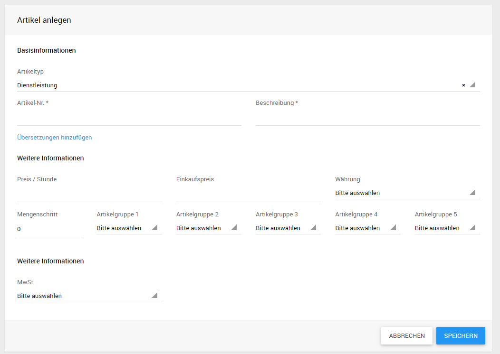

## Artikel Details

In den Artikeldetails lassen sich Tags hinzufügen **(1)**, der Artikel bearbeiten **(2)** sowie Dokumente (zum Beispiel PDF- Dateien) anhängen **(3)**. Auch können Beziehungen zu anderen Artikeln in der Detailansicht im Reiter *Beziehungen* eingepflegt werden.

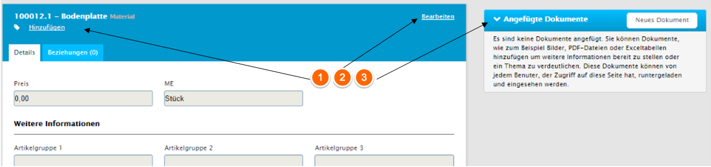

### Dokumente zu Artikeln

Möchte man ein Dokument anhängen, öffnet sich mit „Neues Dokument“ ein entsprechendes Formular. Hier kann ein Dokument für den Upload ausgewählt werden und eine Dokumentenkategorie ausgewählt werden. Mit Hilfe der Dokumentenkategorien kann festgelegt werden, welche der Dokumente in den Offlineclients zur Verfügung gestellt werden sollen. Optional kann noch eine kurze Beschreibung zum Dokument hinzugefügt werden. Handelt es sich bei der ausgewählten Datei um ein Bild, welches als Produktbild verwendet werden soll, kann noch der Haken bei *als Vorschaubild verwenden* gesetzt werden.

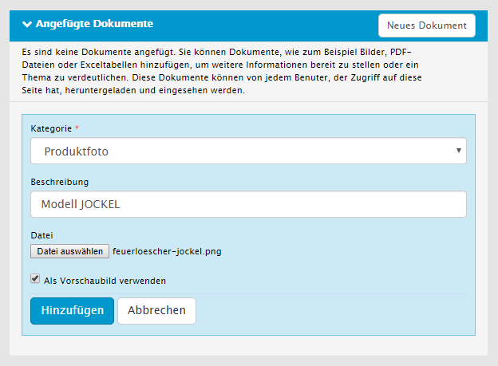

### Artikelbeziehungen{#crmarticle-artikelbeziehungen}

Im Reiter *Beziehungen* werden alle Beziehungen die der aktuell geöffnete Artikel zu anderen Artikeln besitzt angezeigt. Diese können beispielsweise sein:
- Zubehör zu diesem Artikel
- Artikel zu welchen dieser Artikel als Zubehör hinterlegt ist
- Setartikel in denen dieser Artikel enthalten ist
- Artikel die in dem aktuellen Setartikel enthalten sind
Abhängig von den Berechtigungen des angemeldeten Benutzers können in dieser Ansicht auch weitere Beziehungen eingepflegt werden, oder bestehende Beziehungen bearbeitet oder gelöscht werden.

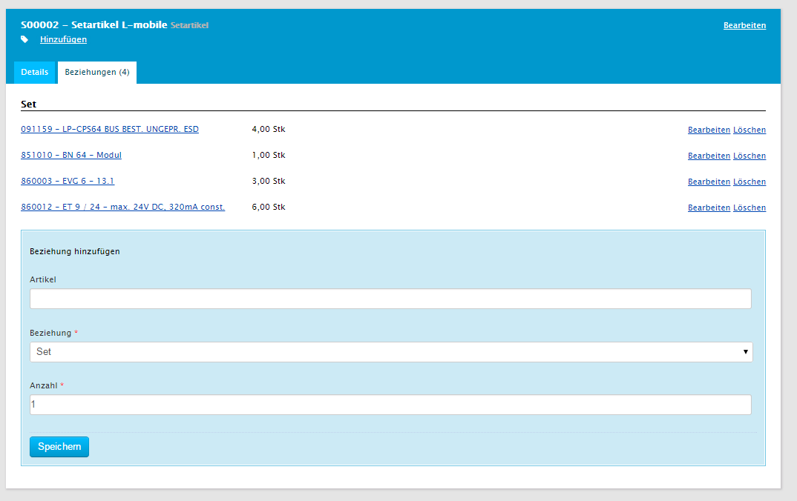

Neben *Zubehör* und *Setartikel* können beliebige weitere Beziehungstypen für Artikelbeziehungen in der Verwaltung der Zuordnungstabellen gepflegt werden. Hierbei besteht die Möglichkeit die Beziehungstypen auf bestimmte Artikeltypen zu beschränken und festzulegen ob für die Beziehungen eine Artikelmenge angegeben werden kann.

## Artikel bearbeiten

Möchte man nun einen Artikel bearbeiten öffnet man die Artikeldetails. Man gelangt über diese zum Bearbeiten. Ist man im Editor angekommen lassen sich Artikelnummer, Beschreibung sowie die Artikelgruppen bearbeiten. Optional lässt sich auch hier der Artikel löschen.

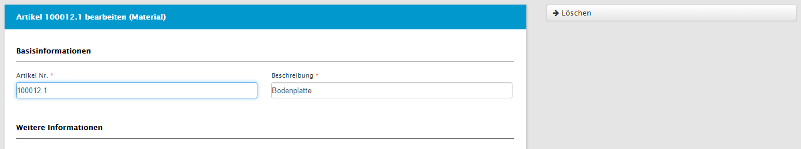

## Produktfamilien

Produktfamilien bieten die Möglichkeit Artikel hierarchisch zu organisieren um im Vertrieb zielgerichteter handeln zu können. Über den Menüpunkt *Stammdaten* - *Produktfamilien* können neue Produktfamilien angelegt und bestehende bearbeitet werden. Innerhalb einer Produktfamilie können dann weitere Produktfamilien als Unterproduktfamilien angelegt werden. Bei der Anlage oder Bearbeitung eines Artikels kann dieser dann einer (Unter-)Produktfamilie zugeordnet werden.