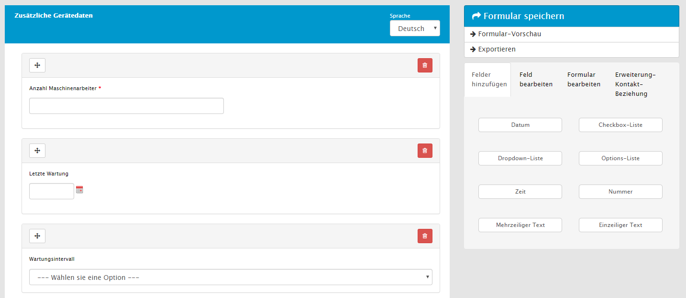
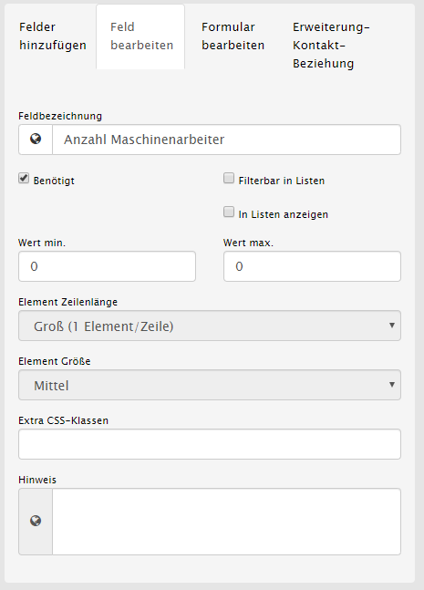
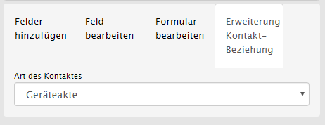
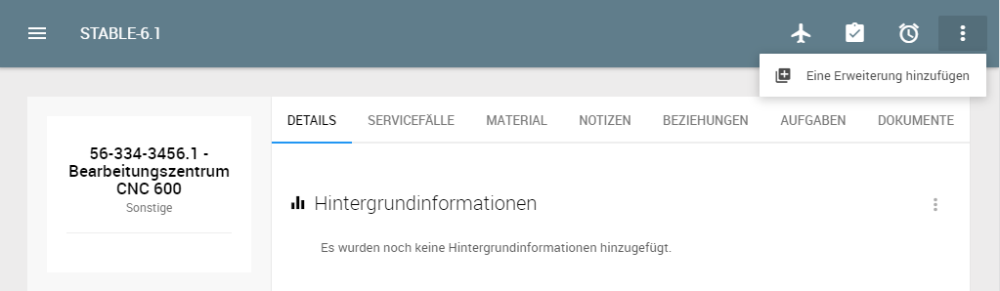
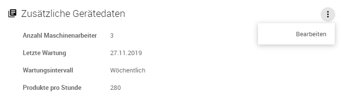
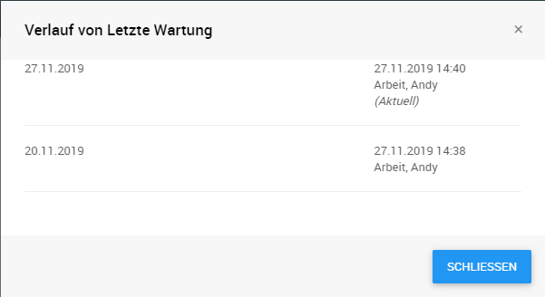
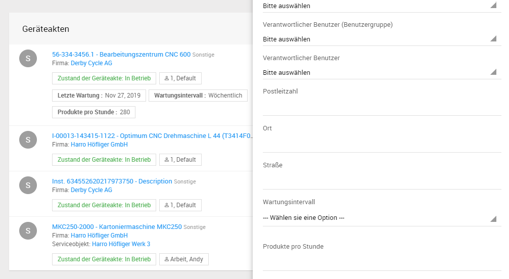

# Erweiterungsformulare (Zusatzmodul)

Die sogenannten Erweiterungsformulare, auch bekannt als Sachmerkmalsleisten, können verwendet werden um erweiterte Stammdaten zu Geräteakten, Firmen, etc. zu erfassen.

Das Modul erlaubt den Benutzern Erweiterungsformulare mit Hilfe des benutzerfreundlichen Formulardesigners über *Stammdaten* -> *Dynamische Formulare* zu erstellen, welche dann im nächsten Schritt mit beliebigen Kontakten verknüpft werden können.

In ein Erweiterungsformular können Elemente aus dem Formulardesigner beliebig platziert werden. Das Layout ist im Gegensatz zu anderen Formulartypen jedoch auf ein einspaltiges Layout beschränkt und es steht nur eine Auswahl der sinnvollen Formularelementtypen zur Verfügung.

Die einzelnen Formularelemente können ausgewählt und mit den bekannten Regeln versehen werden. Es ist außerdem möglich über die Checkbox *Filterbar in Listen* zu definieren welche der Elemente als Filter in Listendarstellungen zur Verfügung stehen sollen und über die Checkbox *In Listen anzeigen* die Werte welcher Elemente in den Ergebnissen dargestellt werden sollen.

Wenn ein Erweiterungsformular erstellt wurde muss im nächsten Schritt über den Reiter *Erweiterung-Kontakt-Beziehung* festgelegt werden, für welchen Kontakttyp das Formular zur Verfügung stehen soll. Je nachdem welche sonstigen Module aktiv sind können dies Artikel, Auftragsvorlagen, Basismaschinen, Besuche, Firmen, Geräteakten, Wartungspläne, Personen, Projekte, Serviceaufträge, Servicefälle, Serviceobjekte, Serviceverträge und Variablen sein.

Wurde ein Formular mit einem Kontakttyp verknüpft und freigegeben kann dieses über die Aktion *Eine Erweiterung hinzufügen* aus der Detailansicht eines entsprechenden Kontaktes ausgewählt werden.

Die hinzugefügten Erweiterungsformulare werden als jeweils separater Abschnitt im Reiter *Details* mit den aktuellen Werten angezeigt und mit Hilfe der Aktion *Bearbeiten* können diese ergänzt oder verändert werden.

Wurden in der Vergangenheit bereits Werte erfasst wird dies durch eine kleine Verlauf-Schaltfläche gekennzeichnet.

Hierüber kann ein Dialog aufgerufen werden, in dem alle historischen Werte detailliert inkl. Datum und Benutzer der Bearbeitungen dargestellt wird. Das macht die Erweiterungsformulare zum perfekten Werkzeug, um Daten wie beispielsweise Betriebsstunden über einen längeren Zeitraum hinweg zu erfassen.

In den Listendarstellungen werden außerdem dynamisch alle aktuellen erfassten Werte die im Designer mit *In Listen anzeigen* gekennzeichnet wurden mit dargestellt.

Alle entsprechend konfigurierten Elemente werden zudem in der Seitenleiste zur Filterung angeboten. Dadurch bietet das Modul mehr als nur eine reine Datenerfassung sondern bietet außerdem Möglichkeiten zur Umstrukturierung der Anwendung und einzelner Elemente ohne eine einzelne Zeile Code schreiben zu müssen.